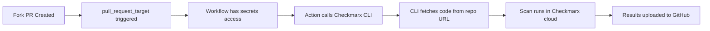

# Checkmarx Scan for Public Repos (Fork-Friendly)

This action enables Checkmarx scanning for fork PRs on public repositories without security risks.

## Problem

Fork PRs cannot access repository secrets (GitHub security feature), which prevents Checkmarx scans from running since they require authentication credentials.

## Solution

This action works with `pull_request_target` to safely scan fork PRs:
1. **No Checkout**: The action does NOT checkout code locally
2. **Remote Scan**: Checkmarx CLI fetches code directly from GitHub using the repo URL
3. **Secure**: `pull_request_target` provides secret access without running untrusted code

## Usage

In your public repository's workflow:

```yaml
name: Checkmarx Security Scan

on:
  pull_request_target:  # Important: use pull_request_target for fork PRs
    types: [opened, synchronize, reopened]

permissions:
  contents: read
  security-events: write  # For uploading SARIF

jobs:
  checkmarx:
    runs-on: ubuntu-latest
    steps:
      # DO NOT CHECKOUT CODE - This is critical for security

      # While upload-sarif-github-action is private:
      - name: Checkout Upload action repository
        uses: actions/checkout@v4
        with:
          repository: midnightntwrk/upload-sarif-github-action
          ref: main  # or specific commit SHA
          path: upload-sarif-github-action
          token: ${{ secrets.MIDNIGHTCI_REPO }}

      - name: Checkmarx Scan (Fork-Friendly)
        uses: ./upload-sarif-github-action/checkmarx-scan-public
        with:
          project-name: ${{ github.repository }}
          cx-client-id: ${{ secrets.CX_CLIENT_ID }}
          cx-client-secret: ${{ secrets.CX_CLIENT_SECRET_EU }}
          cx-tenant: ${{ secrets.CX_TENANT }}

      # Once upload-sarif-github-action is public, simplify to:
      # - name: Checkmarx Scan (Fork-Friendly)
      #   uses: midnightntwrk/upload-sarif-github-action/checkmarx-scan-public@main
      #   with:
      #     ...
```

## Inputs

| Name | Required | Default | Description |
|------|----------|---------|-------------|
| `project-name` | Yes | `${{ github.repository }}` | Checkmarx project name |
| `cx-client-id` | Yes | - | Checkmarx OAuth2 client ID |
| `cx-client-secret` | Yes | - | Checkmarx OAuth2 client secret |
| `cx-tenant` | Yes | - | Checkmarx tenant |
| `base-uri` | No | `https://eu-2.ast.checkmarx.net/` | Checkmarx server URL |
| `repo-url` | No | Auto-detected from PR | Repository URL to scan |
| `branch` | No | Auto-detected from PR | Branch to scan |
| `additional-params` | No | - | Additional CLI parameters |
| `upload-to-github` | No | `true` | Upload SARIF to GitHub Security |
| `scs-repo-token` | No | `github.token` for public repos | GitHub token for SCS/Scorecard scanning |

## Security Model

- `pull_request_target` runs with base branch context (has access to secrets)
- No code checkout means no risk of running malicious code with elevated permissions
- Checkmarx fetches and scans the code in their environment

## Important Notes

1. **Only for Public Repos**: Private repos don't need this (no fork PR issues)
2. **Requires `pull_request_target`**: Regular `pull_request` won't have access to secrets
3. **No Code Checkout**: Never add a checkout step before this action
4. **Testing**: Changes only take effect after merging to main branch

## How It Works



## Troubleshooting

- If scan fails, check Checkmarx server status
- Ensure secrets are properly configured
- Verify the repository is public
- Check that no checkout step is present before the action